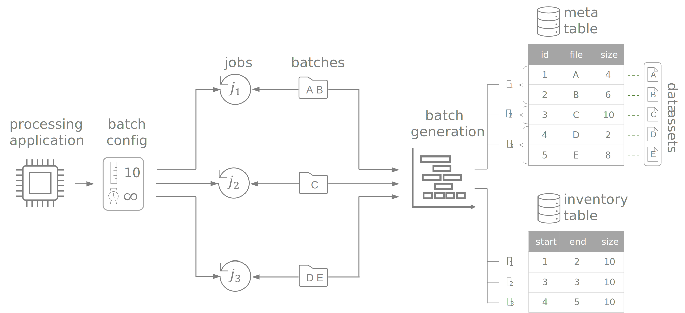

# Requirements specification

This document outlines the requirements specification for a software project named `pybatchintory`. It focuses on *what* the software is supposed to accomplish. 

The problem statement is formulated and the added value is justified. Functional and non-functional requirements are derived. This is primarily intended for developers, architects and stakeholders.

## General description

### Purpose

`pybatchintory` represents a middleware for batch processing data pipelines. It reduces maintenance efforts, improves performance and enhances observability by enabling following features:

- **Incremental processing**: Process only new, unseen data assets without custom bookmarking logic.
- **Backfilling**: Reprocess historical data assets in a configurable and automated manner without manual intervention.
- **Configurable workloads**: Define the amount of data assets to be processed for best predictability and efficiency.
- **Transparency**: Enrich processed data assets with job details like timestamp, identifier and parametrization.

In order to leverage the above features, batch processing applications delegate the responsibility of generating batches of data assets to `pybatchintory`.

The primary use case are **file-based batch processing pipelines**. For example, Parquet files are stored in a cloud object store like Azure Blob and need to be processed via Apache Spark twice a day.

However, `pybatchintory` is not limited on any specific type or format because it is data asset agnostic. It is possible to generate batches of work that represent partitioning keys in table formats or distributed databases. 

Conceptionally, `pybatchintory` provides an API to generate and interact with batches of data assets while maintaining state and hiding implementation details. Only metadata about data assets is consumed while the actual data is not read.

### Rationale

The following section summarizes the contextual background from which `pybatchintory` originates with its purpose and added value.  

#### Incremental processing

Incremental processing greatly improves data pipeline performance by only processing unseen data assets. This prevents costly reprocessing of entire datasets. 

While incremental processing is supported in stream processing frameworks by design (e.g. Storm or Flink), this functionality is rarely available in batch processing frameworks. Only very few off-the-shelf solutions provide easy-to-use abstractions to handle incremental batch semantics (e.g., [AWS Glue Bookmarks](https://docs.aws.amazon.com/glue/latest/dg/monitor-continuations.html)). More often than not, custom solutions are used in production environments. Typically, these rely on timestamp comparisons or manually maintained offsets which closely resembles what stream processing frameworks offer out-of-the-box.

??? question "Why not use stream instead of batch processing?"

    For non-time-sensitive tasks, batch processing provides two significant advantages over stream processing:

    1. **Resource efficiency**: Batch processing allows for aggregation of large amounts of data at once, utilizing compute and memory resources more effectively while being more cost-effective overall.
    
    2. **Managing complexity**: Batch processing is easer to reason about because data is bounded and finite. Moreover, implementing complex logic on unbounded streams of data is very challenging to develop and maintain.

??? question "What are other solutions for incremental batch processing?"

    More solutions exist which offer incremental processing. However, they tend fall short in one regard or the other.

    - **Databrick**'s [Autoloader](https://docs.databricks.com/ingestion/auto-loader/index.html) enables incremental processing of files in cloud objects stores, too. However, it does not support batch processing but only integrates with [Spark Streaming](https://spark.apache.org/docs/latest/structured-streaming-programming-guide.html) and its associated [limitations](https://spark.apache.org/docs/latest/structured-streaming-programming-guide.html#unsupported-operations).
    - Likewise, **Flink**'s [unbounded file data source](https://nightlies.apache.org/flink/flink-docs-release-1.17/docs/connectors/datastream/filesystem/#bounded-and-unbounded-streams) continously monitors for new files at a given location. However, downstream computations using this data source can only run in unbounded, [streaming execution mode](https://nightlies.apache.org/flink/flink-docs-master/docs/dev/datastream/execution_mode/#when-canshould-i-use-batch-execution-mode).
    - **Apache Hudi**'s [DeltaStreamer](https://hudi.apache.org/docs/hoodie_deltastreamer/) provides incremental processing semantics, too. Data can be ingested from various sources into Hudi tables only. Moreover, [transformers](https://hudi.apache.org/docs/next/transforms/) allow to implement custom wrangling logic. However, this solution is limited to Java and may not be suitable for pipelines with high complexity.

#### Backfilling

Reprocessing of data is not an uncommon theme. Bugs need to be fixed in production pipelines not just for future but also for existing past data. Added features such as new KPIs need to be made available not just from now on but also for the data of recent years. Hence, historical data needs to be reprocessed. 

However, first class support for such scenarios is currently not available. Processing all historical data at once can eventually become very costly and error prone because the accumulated volume of data may exceed a threshold of feasibility. Hence, manual planning and execution is often required to create processable chunks of work.

#### Configurable Workloads

Data assets are not generated evenly over time. Rather, the data generation process often exhibits seasonality and spikes resulting in greatly differing volumes of data per time interval. If auto-scaling is not available, processing applications may drastically drop in performance (e.g., due to insufficient memory forcing disk spills) or may even fail completely (e.g., out of memory error). Even with auto-scaling being enabled, performance degradation is likely because perfect parallelization via horizontal scaling is almost never possible in distributed systems. 

A simple and effective solution is to limit the amount of data to be processed at once by a single batch job. However, batch processing frameworks don't provide native support this functionality, yet.

#### Observability

Frequently, doubts arise regarding data integrity and reliability. Customers may question results shown in an end user dashboard. To be able to troubleshoot, underlying data pipelines need to be easily inspectable to verify that all available data assets have been processed correctly. Moreover, a certain data asset needs to be traceable in regard to when it was processed by which processing application. 

### Terminiology

This section defines core concepts and provides a high level overview:

- **Processing application**: Resembles the application that actually reads and processes the content of data assets. It utilizes `pybatchintory` to generate batches of data assets.
- **Batch configuration:** Specifies the characteristics of the batch generation process.
- **Jobs:** Represent one or more executions of the processing application. Each instantiation invokes `pybatchintory` to fetch batches of data assets.
- **Batches:** Contain references to one or more data assets.
- **Batch generation:** Resembles the process of generating new batches of data assets. Its result is determined by the *batch configuration*, the *inventory table* and the *meta table*. It embodies the core logic enabling incremental and backfilling semantics with predictable workloads. 
- **Inventory table:** Represents the backend table of `pybatchintory`. It maintains state of historically executed jobs and processed data items.
- **Meta table:** Contains meta information about data assets like file location and size. `pybatchintory` leverages it to generate batches of data assets.
- **Data assets:** Represent arbitrary processable units of work. Typically, these are Parquet or JSON files stored in an object store such as AWS S3 or Azure Blob. However, since `pybatchintory` makes no strong assumptions about them, it can be anything consumable by a processing application.

### Precondition

In order to generate batches of data assets, the existence of a metadata table is mandatory. At minimum, it needs to contain a reference to the data item (e.g, file location) and a primary key as unique row identifier. Since *pybatchintory* generates chronologically sorted ranges of data items, the primary key needs to chronologically sorted, too.

### Limitation

The batch generation process will only support consecutive data assets in chronologically increasing order. This greatly reduces complextiy and simplifies the implementation. Future versions may loosen this restriction.

### User Stories

- As a developer, I want a dedicated solution to support incremental processing for batch pipelines.
- As a developer, I want a managed solution to reprocess historical data in configurable chunks.
- As a developer, I want to specify the amount of data that is consumed by a single processing application job.
- As a stakeholder/developer, I want predictable run times and best performance/cost-ratio.
- As a user/developer, I want to understand when a given data asset was processed by which job.
- As a user/developer, I want to retrieve the backlog size of unprocessed data assets for a given job.

## Specific requirements

### Terminiology

This section extends the existing terminiology with more detailed concepts which are relevant for the specific requirements.

- **Backlog**: Describes the remaining amount of unprocessed data assets for a given job.
- **Data asset type**: Summarizes data assets that semantically belong together such as a directory of parquet files containing IoT data accross various devices and time ranges.
- **Batch window**: Specifies the range of data assets to be included in the batch generation process. Data assets outside this window are not relevant for the batch generation process. The window is defined by a lower and upper boundary which define the first and last data assets to be included, respectively.
- **Batch status**: Defines the possible states of a batch of data assets. This includes "processing", "succeeded" and "failed".

### Functional requirements

#### Data Asset Selection

Allow defining the metadata table that references the relevant data assets.

#### Data Asset Filtering

Allow providing a filter condition to subset data assets from the metadata table. This is crucial in case the metadata table holds references to multiple data asset types.  The filtering method should be as flexible as possible to support a wide range of metadata table models.

#### Incremental processing

Allow fetching non-processed data assets with no upper boundary for the batch window. Hence, newly added data assets will be included from one job run to another. The total amount of relevant data assets is dynamic and changes over time.

#### Backfilling

Allow fetching non-processed data assets with an upper boundary for the batch window. Hence, newly added data assets will be excluded from one job run to another. The total amount of relevant data assets is fixed and remains constant over time.

#### Chronology

Always fetch data assets in chronological order starting with the oldest ones. 

#### Configure workloads

Allow to specify the maximum workload that a single job processes. This includes two possbile criteria. First, define the maximum number of data assets. Second, define the maximum weight as the total sum of data asset size. 

The weight criteria depends on the existence of a weight attribute being present in the metadata table. If not given, no weight can be computed. 

In case no criteria is specified, all non-processed data is fetched. If both criteria are specified, the one which first exceeds the threshold applies.

#### Retry mechanism

Allow to select failed batches of data assets for retry processing. Store the number of attempts for a batch of data assets. Allow a configurable retry count upon failure.

#### Single job and multiple batches

Allow a single job to process multiple batches consecutively while specifying the total number of iterations. 

#### Recursivity

#### Concurrent processing

Enable multiple jobs to process disjunct ranges of a single type of data assets simultaneously. This allows to parallelize jobs with predictable workloads to quickly process large amounts of backlogs. 

Before a job starts processing data assets, it has to acquire them. This marks these data assets as being reserved while preventing other jobs to simultaneously process them. Once the job has finished, it can release the of data assets with a given result status such as being succeeded or failed. 

#### Observability

### Non-functional requirements

#### Usability

#### Reliability

#### Performance

#### Security

#### Maintainability

### Interfaces

#### Programmatic API

#### Command Line Client CLI
